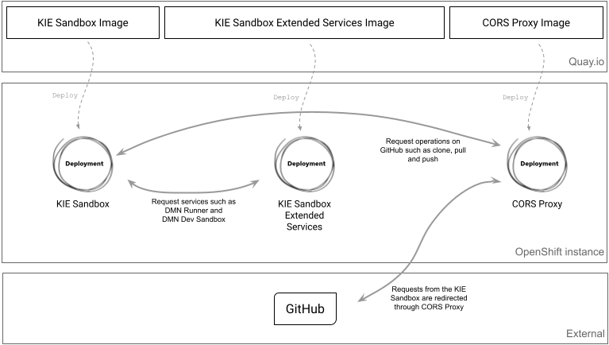

# Kie Sandbox Helm Deploy

Kie Sandbox Helm Chart customizes and deploys Kie Sandbox from the Red Hat.
# Architecture

# Useful Links

[Kie Tools GitHub Releases](https://github.com/kiegroup/kie-tools/releases/)

[Kie Tools GitHub](https://github.com/kiegroup/kie-tools/)

[Kie Tools Quay](https://quay.io/user/kie-tools)

[DEPLOY YOUR KIE SANDBOX TO OPENSHIFT](https://blog.kie.org/2022/01/deploy-your-kie-sandbox-to-openshift.html)

[[KIELive#40] DMN Dev Sandbox Developing and deploying DMN decisions in the cloud](https://www.youtube.com/watch?v=2zY85TXFNuw)

[[KIELive#53] KIE Sandbox: Introducing a new generation of online authoring tools](https://www.youtube.com/watch?v=F4CeNUyTZjo)

[Kie Tools 0.21.0](https://github.com/kiegroup/kie-tools/releases/tag/0.21.0)

[KOGITO 1.24.0 RELEASED!](https://blog.kie.org/2022/07/kogito-1-24-0-released.html)

[KIE Sandbox: top 7 key new features](https://ederign.me/2022/02/03/kie-sandbox.html)
